# TO - Do List

## Screenshoot

### Without Task 

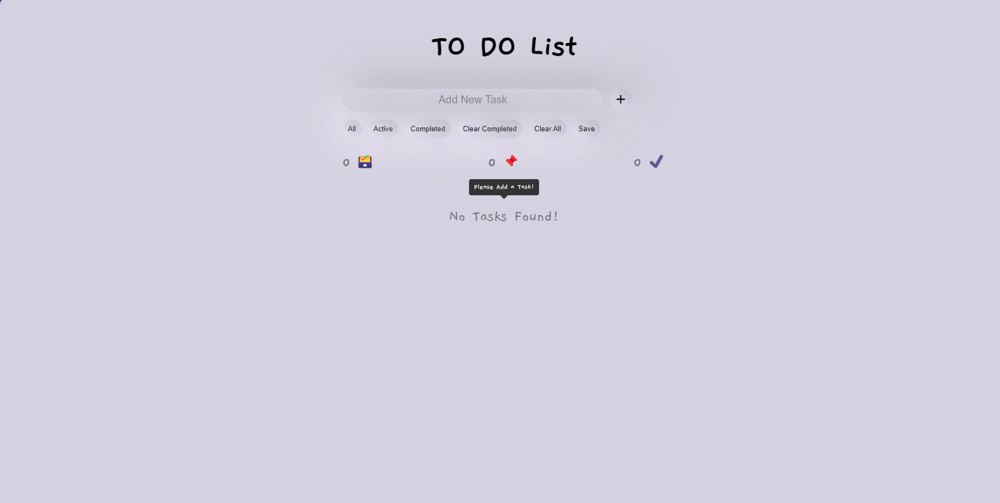

### Alert Task is Added 

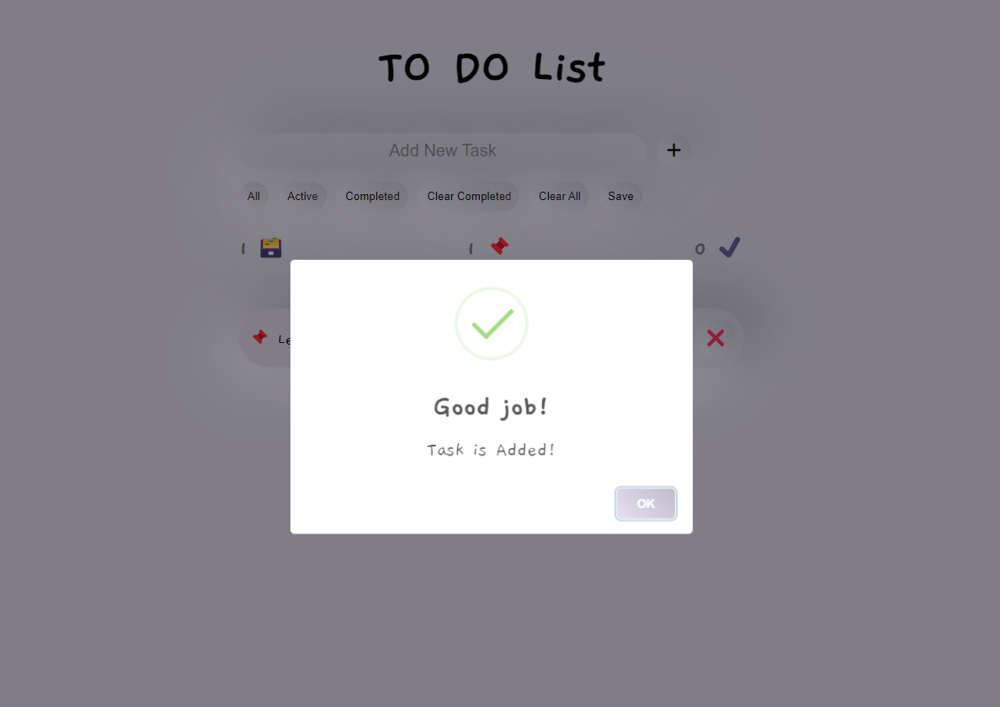

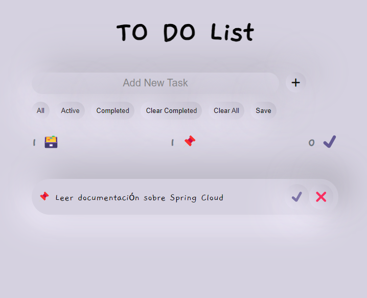

### Completed task

### More task 

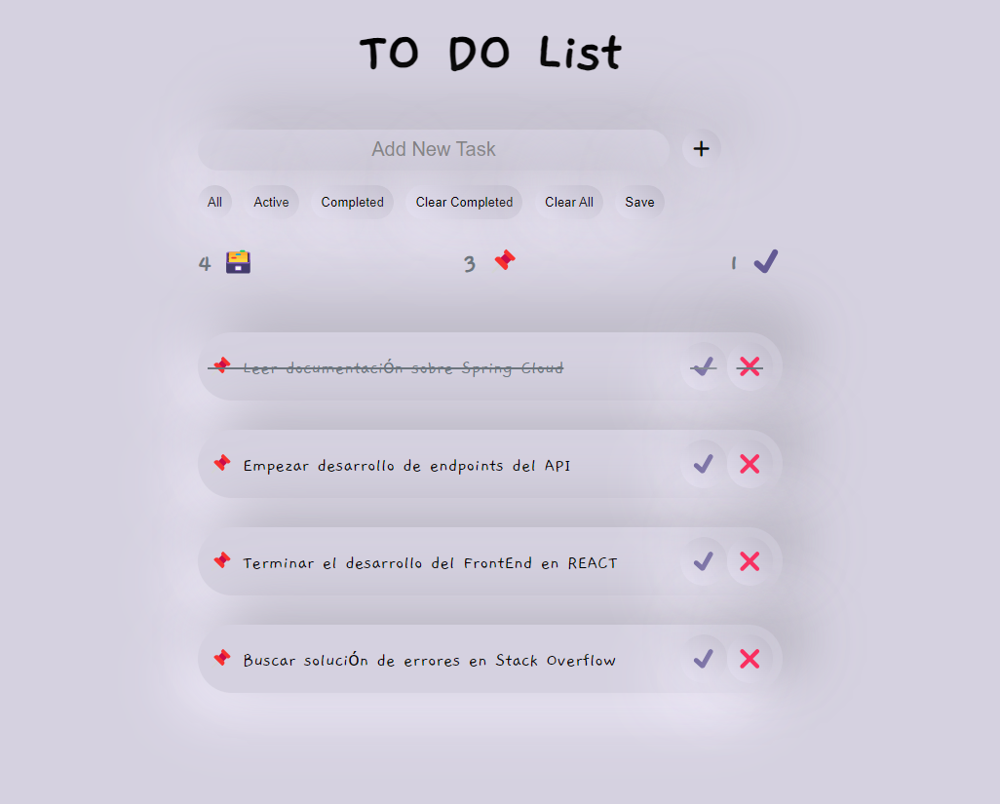

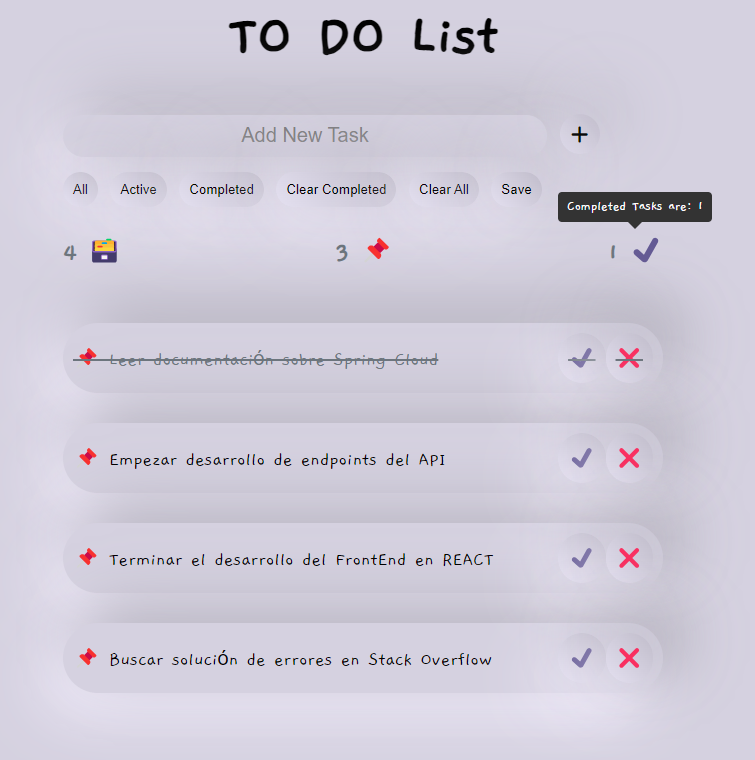

### Filters 

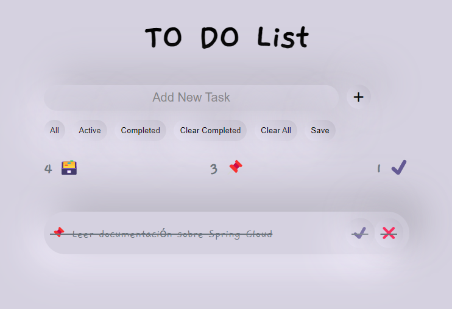

### Delete Task 

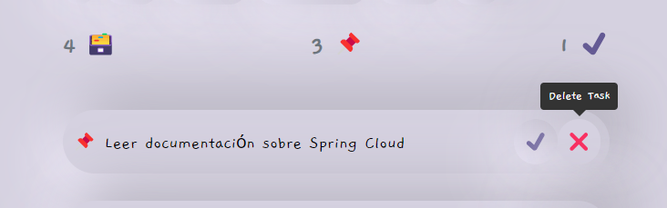

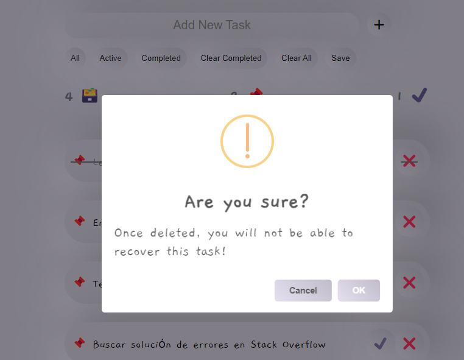

#### Not Deleted

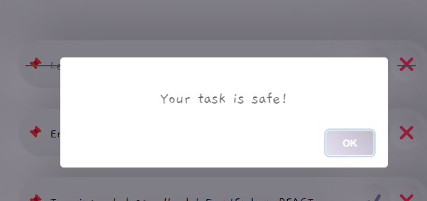

#### Deleted 

### Saved in Local Storage

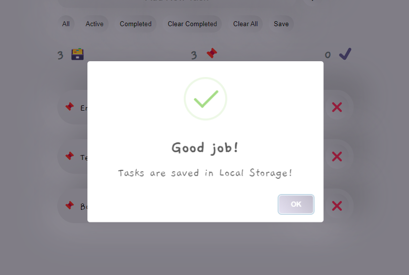

### Input Validation

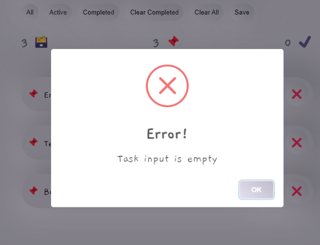
